# 👋 Hi, I'm Allar

> I worked 10+ years in construction (ventilation, 3D/BIM).  
> Now I build software in C/C++ and TypeScript.

---

### About me

- Based in Finland, studying at **Hive Helsinki (42)**.  
- Strong in **C / C++** (concurrency, optimization, memory), and **backend** with **TypeScript/Node.js**.  
- Comfortable with **Docker/Kubernetes**, **AWS**, and observability (**Prometheus, Grafana**).  

---

### What I’m focusing on now

<table>
<tr>
<td>

- C / Modern C++ (17/20/23)
- Concurrency & profiling
- Real-time systems

</td>
<td>

- Node.js / TypeScript (Fastify)  
- REST & WebSockets  
- OAuth2/JWT

</td>
<td>

- Docker & k8s  
- AWS (Lambda/SQS/DynamoDB)  
- Observability (Prom/Grafana)

</td>
</tr>
</table>

---

### Languages I use

[<code></code>](https://devdocs.io/c/)
[<code></code>](https://isocpp.org/)
[<code></code>](https://nodejs.org/en/docs/)
[<code></code>](https://www.typescriptlang.org/docs/)
[<code></code>](https://www.python.org/doc/)
[<code></code>](https://learn.microsoft.com/dotnet/)
[<code></code>](https://www.gnu.org/software/bash/manual/)
[<code></code>](https://sqlite.org/docs.html)
[<code></code>](https://go.dev/)

---

### Tech I’ve used

[<code></code>](https://www.fastify.io/docs/latest/)
[<code></code>](https://expressjs.com/)
[<code></code>](https://react.dev/)
[<code></code>](https://www.postgresql.org/docs/)
[<code></code>](https://redis.io/docs/)
[<code></code>](https://docs.docker.com/)
[<code></code>](https://kubernetes.io/docs/home/)
[<code></code>](https://docs.aws.amazon.com/)
[<code></code>](https://nginx.org/en/docs/)
[<code></code>](https://prometheus.io/docs/introduction/overview/)
[<code></code>](https://grafana.com/docs/)

---

### 42 – Projects

[<code></code>](https://github.com/Wassaaa/libft)
[<code></code>](https://github.com/Wassaaa/ft_get_next_line)
[<code>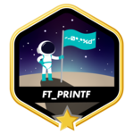</code>](https://github.com/Wassaaa/ft_printf)
[<code></code>](https://github.com/Wassaaa/so_long)
[<code></code>](https://github.com/Wassaaa/push_swap)
[<code></code>](https://github.com/Wassaaa/minitalk)
[<code></code>](https://github.com/Wassaaa/minishell)
[<code></code>](https://github.com/Wassaaa/philosophers)
[<code></code>](https://github.com/Wassaaa/minirt)
[<code></code>](https://github.com/Wassaaa/ft_irc)
[<code>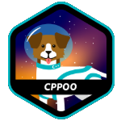</code>](https://github.com/Wassaaa/cpp00)
[<code>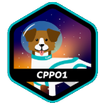</code>](https://github.com/Wassaaa/cpp01)
[<code>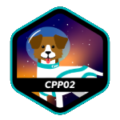</code>](https://github.com/Wassaaa/cpp02)
[<code>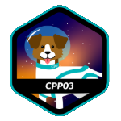</code>](https://github.com/Wassaaa/cpp03)
[<code>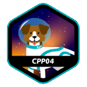</code>](https://github.com/Wassaaa/cpp04)
[<code>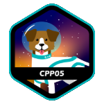</code>](https://github.com/Wassaaa/cpp05)
[<code>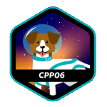</code>](https://github.com/Wassaaa/cpp06)
[<code>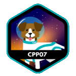</code>](https://github.com/Wassaaa/cpp07)
[<code>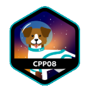</code>](https://github.com/Wassaaa/cpp08)
[<code>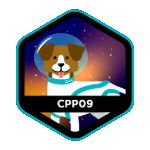</code>](https://github.com/Wassaaa/cpp09)
[<code></code>](https://github.com/Wassaaa/inception)
[<code></code>](https://github.com/Wassaaa/ft_transcendence)

---

### Other projects

- **Venttools (Angular/TypeScript)** – Calculates ventilation installation times (Finnish TES).  
  Cloud-deployed, with Prometheus + Grafana dashboards; validated with Solibri.  
  [🔗 Repo](https://github.com/Wassaaa) <!-- replace with direct repo when public -->

---

### Want to learn next

- Deeper **.NET/C#** for desktop + services    
- **gRPC / Kafka / RabbitMQ** patterns  
- **Signal processing basics** (FFT, spectrograms)  
- **Rust** for systems programming
- **Godot** for making some games

---

### Contact

- 📧 **Email:** allarklein@gmail.com  
- 💼 **LinkedIn:** https://linkedin.com/in/allarklein  
- 🐙 **GitHub:** https://github.com/Wassaaa
